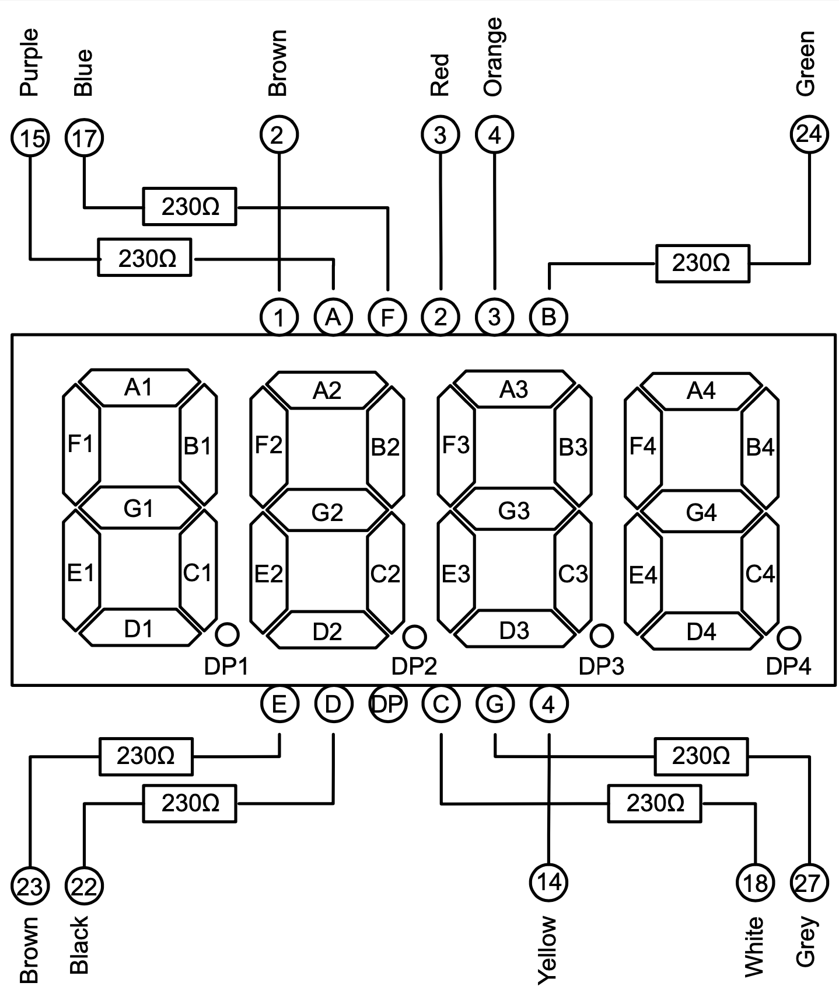
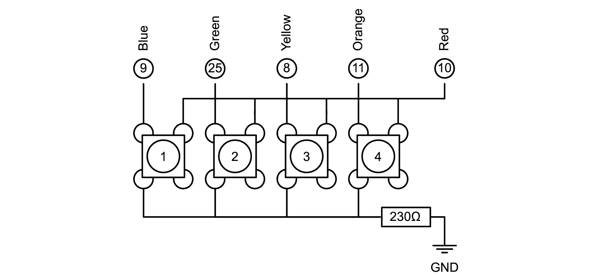

# Automated Cat Feeding Device

A Raspi project to ensure consistent dinner times for the cat when I am not home.

## About

My cat wants food at specific hours. This repository is the blueprint for an automated cat feeding device. You fill it with food, set a timer and it keeps the food until the programmed time is up.

## Hardware

The Automated Cat Feeding Device (ACFD) consists of four hardware modules:

 * [Raspberry Pi Zero, without WiFi](https://www.buyapi.ca/product/raspberry-pi-zero-w/)  

 * [Time Display PCB](timer)

   * 1x [12 Pin Common Cathode 7-Segment Display](https://www.amazon.ca/DOLITY-Segement-Displays-Common-Cathode/dp/B07GVKQWDX)
   * 7x 250Ω Resistor
   * 1x [Mini PCB](https://www.amazon.ca/Gikfun-Solder-able-Breadboard-Arduino-Electronic/dp/B077938SQF)
   * [Jumper Wires](https://www.amazon.ca/Elegoo-120pcs-Multicolored-Breadboard-arduino/dp/B01EV70C78)
 * [4 Button Keypad](keypad)  

   * 4x [Tactile Push Buttons](https://www.amazon.ca/Ocr-10Value-Tactile-Momentary-Assortment/dp/B01NAJEVE3)
   * 1x 250Ω Resistor
   * 1x [Mini PCB](https://www.amazon.ca/Gikfun-Solder-able-Breadboard-Arduino-Electronic/dp/B077938SQF)
   * [Jumper Wires](https://www.amazon.ca/Elegoo-120pcs-Multicolored-Breadboard-arduino/dp/B01EV70C78)
 * Lid Lifter
   * 1x [28byj Stepper Motor](https://www.amazon.ca/Titri-28BYJ-48-Stepper-Motor-5V/dp/B07PS2MJCX)
   * 1x [ULN2003 Driver Board](https://www.amazon.ca/ULN2003-Controller-Stepping-Electric-Control/dp/B07P5C2KWX)
   * 1x [Universal Mount Hub](https://www.amazon.ca/Coupling-Connector-Coupler-Accessory-Fittings/dp/B08334MFVT)

## Wiring

Raspi-400:

| 01 | 02 | 03 | 04 | 05 | 06 | 07 | 08 | 09 | 10 | 11 | 12 | 13 | 14 | 15 | 16 | 17 | 18 | 19 | 20 |
|---|---|---|---|---|---|---|---|---|---|---|---|---|---|---|---|---|---|---|---|
| 5V | 5V | GND | 14 | 15 | 18 | GND | 23 | 24 | GND | 25 | 8 | 7 | EEPROM | GND | 12 | GND | 16 | 20 | 21 |
| 3V3 | 2 | 3 | 4 | GND | 17 | 27 | 22 | 3V3 | 10 | 9 | 11 | GND | EEPROM | 5 | 6 | 13 | 19 | 26 | GND |

Raspi-Zero:

| 01 | 02 | 03 | 04 | 05 | 06 | 07 | 08 | 09 | 10 | 11 | 12 | 13 | 14 | 15 | 16 | 17 | 18 | 19 | 20 |
|---|---|---|---|---|---|---|---|---|---|---|---|---|---|---|---|---|---|---|---|
| GND | 26 | 19 | 13 | 6 | 5 | EEPROM | GND | 11 | 9 | 10 | 3V3 | 22 | 27 | 17 | GND | 4 | 3 | 2 | 3V3 |
| 21 | 20 | 16 | GND | 12 | GND | EEPROM | 7 | 8 | 25 | GND | 24 | 23 | GND | 18 | 15 | 14 | GND | 5V | 5V |


## Software 

Before full assembly, use below scripts to test individual ACFD components:

 * [Display Test](modtest/display-test.py): Test Time Display PCB and wiring with a fast countdown 9999-0000.  
```python3 ./display-test.py```.
 * [Keypad Test](modtest/keypad-test.py): Test Keypad PDB and wiring with on terminal display of pressed buttons.  
```python3 ./keypad-test.py```

...

## Contact / Pull Requests

 * Author: Maximilian Schiedermeier 
 * Github: Kartoffelquadrat
 * Webpage: https://www.cs.mcgill.ca/~mschie3
 * License: [MIT](https://opensource.org/licenses/MIT)

